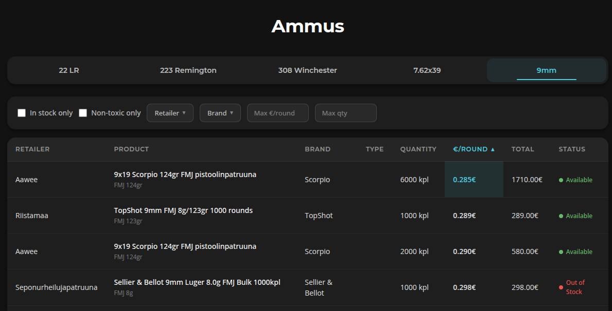

<div align="center">

# Ammus

**Patruunoiden hintavertailu**

Compare ammunition prices across 25 Finnish online retailers — updated automatically.

[](LICENSE)
[](https://nodejs.org)
[](https://react.dev)

</div>

---

### Contents

[Features](#features) · [Screenshot](#screenshot) · [Quick Start](#quick-start) · [Scripts](#scripts) · [How It Works](#how-it-works) · [Data Format](#data-format) · [Contributing](#contributing)

---

## Features

- Price comparison across **25 Finnish retailers** for 5 calibers: 22 LR, .223 Rem, .308 Win, 7.62x39, 9mm
- Sortable columns: retailer, product, brand, type, quantity, price per round, total, availability
- Non-toxic ammunition detection and filtering (Sako Blade, Norma EcoStrike, Lapua Naturalis, etc.)
- Multi-select filters for retailer, brand, max price, and max quantity
- Click any row to open the retailer's product page
- Dark theme with responsive design
- Prices scraped automatically via GitHub Actions

## Screenshot



## Quick Start

```bash
git clone https://github.com/laveez/ammus.git
cd ammus
npm install
npm run dev
```

Opens at [localhost:5173](http://localhost:5173).

## Scripts

| Command | Description |
|---|---|
| `npm run dev` | Start dev server |
| `npm run build` | TypeScript check + production build |
| `npm run lint` | Run ESLint |
| `npm run lint:fix` | Run ESLint with auto-fix |
| `npm run fetch-prices` | Scrape all retailers, update products.json |
| `npm run fetch-prices -- --dry-run` | Preview scrape without writing |
| `npm run discover-variants` | Find new product variants |

## How It Works

```mermaid
flowchart LR
    A[Playwright<br/>scraper] --> B[25 retailer<br/>websites]
    B --> C[Extract prices<br/>JSON-LD · meta · DOM · regex]
    C --> D[products.json]
    D --> E[React app<br/>filter · sort · display]

    style A fill:#2d4a2d
    style D fill:#38608c
    style E fill:#2d4a2d
```



The scraper visits each product URL with headless Chromium, extracting prices and stock status using multiple strategies (JSON-LD, meta tags, DOM selectors, JS variables, text regex). Non-toxic ammunition is detected by product name matching against known product lines.

GitHub Actions runs the scraper on every push to master, commits any price changes, and deploys the built site to GitHub Pages.

## Data Format

Product data lives in `src/data/products.json`:

```json
{
  "calibers": ["22 LR", ".223 Remington", ".308 Winchester", "7.62x39", "9mm"],
  "products": {
    "9mm": [
      {
        "url": "https://...",
        "retailer": "Store Name",
        "productName": "Product Name",
        "brand": "Brand",
        "quantity": "50",
        "pricePerRound": "0.25 €",
        "total": "12.50 €",
        "status": "Available",
        "nonToxic": false
      }
    ]
  }
}
```

## Contributing

Contributions are welcome! Open an issue or submit a PR.

```bash
git clone https://github.com/laveez/ammus.git
cd ammus
npm install
npm run dev
```

## License

[MIT](LICENSE)
